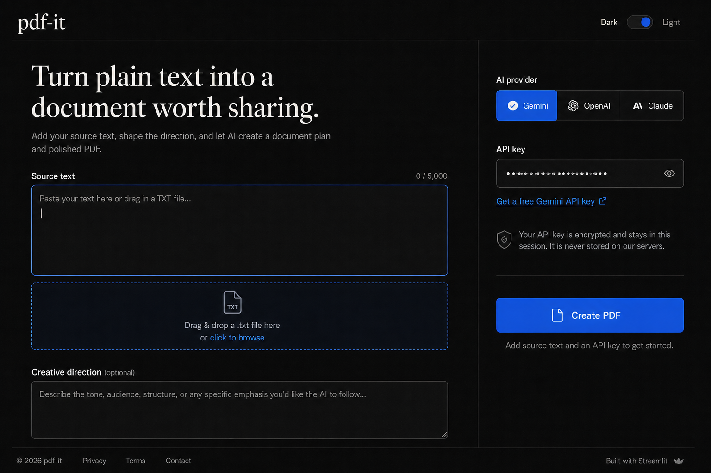

# pdf-it

pdf-it turns mixed source material into a structured, visually polished PDF. Users can combine
free text, up to 5 uploaded files, and YouTube transcript links or video IDs; LangChain requests
a validated editorial plan, then ReportLab renders the document locally and deterministically.

The name is a light play on “f*** it”: drop in the text, choose a provider, and make the PDF.



## What it does

- Accepts pasted text plus up to 5 uploaded files in one request.
- Supports TXT, Markdown, PDF, DOCX, GDOC, CSV, XLSX, common code files, and audio uploads.
- Pulls YouTube transcripts from captioned links or raw video IDs and can render them
  locally without an API key when provider planning is unavailable.
- Adds optional audience, tone, structure, and emphasis guidance.
- Lets users choose a provider-specific model in the UI.
- Supports Gemini, OpenAI, and Claude through separate LangChain integrations.
- Uses pandas to convert CSV/XLSX uploads into dataframe-style text before prompting.
- Transcribes audio with Gemini or OpenAI before document planning.
- Produces searchable A4 PDFs with a title hierarchy, summary, sections, callouts, and pages.
- Starts in a native dark theme, offers a light theme, and signals Dark Reader not to invert it.
- Keeps API keys in the active Streamlit session and never writes keys or documents to disk.

Current defaults are centralized in `src/pdf_it/config.py`:

| Provider | Model |
| --- | --- |
| Gemini | `gemini-3.1-flash-lite` |
| OpenAI | `gpt-5.4-mini` |
| Anthropic | `claude-sonnet-4-6` |

Model access and pricing vary by account, and each provider now exposes multiple selectable
models in the UI. Change a default in one place if a provider retires or replaces a model.

## Run locally

Python 3.12 is the deployment target.

```powershell
python -m venv .venv
.venv\Scripts\Activate.ps1
python -m pip install -r requirements-dev.txt
streamlit run app.py
```

On macOS or Linux, activate with `source .venv/bin/activate`.

The app asks for a provider key in the UI. Do not add personal keys to `.env`, tracked files,
screenshots, issue reports, or Streamlit configuration. If you use local environment variables
for unrelated tooling, copy `.env.example` to `.env`; `.env` is ignored by Git.

### Get a Gemini key

1. Open [Google AI Studio](https://aistudio.google.com/app/apikey).
2. Sign in and select **Create API key**.
3. Paste the key into pdf-it after selecting Gemini.

Google controls free-tier availability and limits, and free-tier Gemini API usage is subject to
Google data collection and provider terms. Review the latest terms shown in AI Studio.

## Test

```powershell
python -m ruff check .
python -m pytest --cov=pdf_it
```

The focused suite covers validation, UTF-8 uploads, provider routing, prompt boundaries,
structured output, PDF pagination/searchability, markup escaping, and Streamlit state.
See [docs/verification.md](docs/verification.md) for the latest manual and live-provider checks.

## Deploy to Streamlit Community Cloud

1. Push this repository with `main` as the default branch.
2. In Streamlit Community Cloud, create an app from the repository.
3. Set the entrypoint to `app.py` and deploy. `runtime.txt` selects Python 3.12.
4. Do not add provider keys to Community Cloud secrets; users provide their own keys per session.
5. After deployment, verify all three provider paths with separate low-risk sample text.

The app accepts uploads up to 10 MB per file. Streamlit Community Cloud installs
`requirements.txt`, including the local package via `-e .`. The default theme and upload limit
are configured in `.streamlit/config.toml`.

## Architecture

```text
Streamlit UI
   | validate text/upload and session key
   v
LangChain provider adapter
   | structured DocumentPlan (Pydantic)
   v
ReportLab renderer
   | in-memory bytes only
   v
Browser PDF download
```

- `app.py` owns only UI and session behavior.
- `src/pdf_it/providers.py` constructs short-lived provider clients without global key state.
- `src/pdf_it/prompts.py` treats source content as data and prohibits unsupported inventions.
- `src/pdf_it/schemas.py` constrains model output before rendering.
- `src/pdf_it/pdf_renderer.py` escapes model text and builds the PDF without HTML conversion.
- `src/pdf_it/service.py` coordinates the provider-neutral workflow.

## Privacy and security

Source text and the API key are necessarily sent to the selected AI provider. They also exist in
the active Streamlit server session while the page is open. pdf-it does not add persistence,
analytics, application logging, or server-side files. Provider retention and training policies
still apply; do not submit material that the chosen provider is not permitted to process.

See [SECURITY.md](SECURITY.md) for reporting and key-rotation guidance.

## License

MIT
